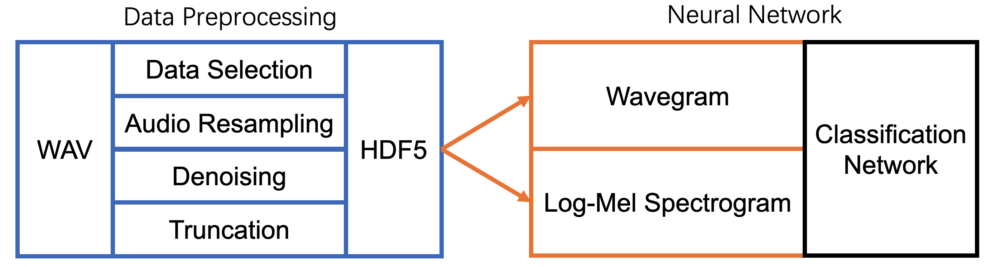
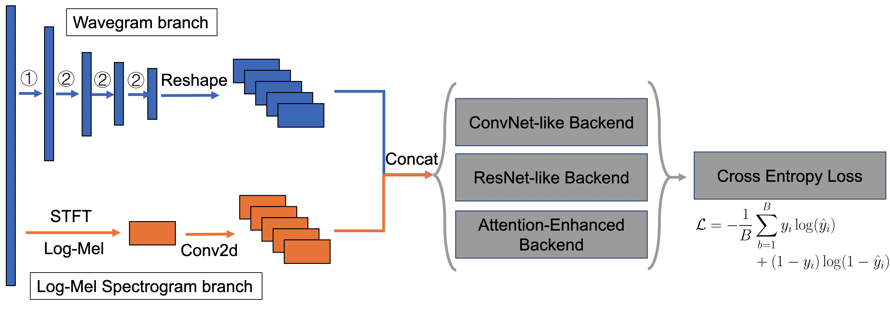
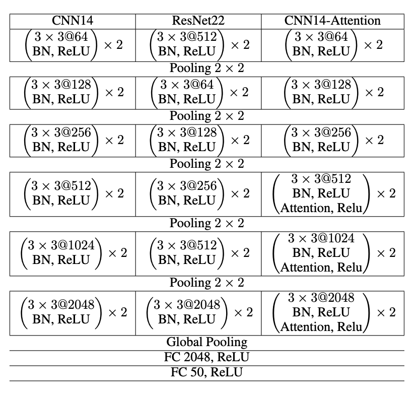
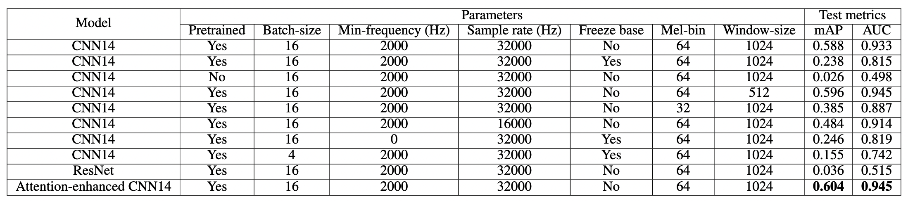

# Singing Birds: Bird Species Identification Using Sound

Project repository for ECE 228 Machine Learning for Physical Applications. 

## Introduction

Identifying bird species plays a significant role in biodiversity study. However, commonly used motion-sensor cameras usually fail to capture bird activities in the wild, due to the high mobility of birds and blockage. Bird chirps are more promising for the relevant study since they propagate through obstacles and can be captured with cheaper microphones.

Most existing works of audio classification see the data as a temporal sequence. Yet Kong[2] argues spectrograms of audios contain both time and frequency-domain information. We follow the proposed idea and our contributions or scientific merits are:

+ Explored different CNN-based methods of bird sound classification[1] based on audio spectrogram, and also enhanced the model with attention mechanism.
+ Studied the influence of different hyperparameters;
+ Achieved a 58.76% mAP and 93.27% AUC a subset of a birdcall dataset.


## How to run the codes

In order to run the codes, please first download the requirements:

```bash
pip install -r requirements.txt
```

### To run the demo

To run the demo, please download the model we trained on the  [Cornell Birdcall Identification datase](https://www.kaggle.com/c/birdsong-recognition) at [here](https://drive.google.com/file/d/1T3LqRHuWRKqmSF1MnbWUMvMKCjS7zd1N/view?usp=sharing) or the the command in terminal:

```bash
FILENAME="cnn14_birdcall_mAP=5876.pth"
wget --load-cookies /tmp/cookies.txt "https://docs.google.com/uc?export=download&confirm=$(wget --quiet --save-cookies /tmp/cookies.txt --keep-session-cookies --no-check-certificate 'https://docs.google.com/uc?export=download&id=1T3LqRHuWRKqmSF1MnbWUMvMKCjS7zd1N' -O- | sed -rn 's/.*confirm=([0-9A-Za-z_]+).*/\1\n/p')&id=1T3LqRHuWRKqmSF1MnbWUMvMKCjS7zd1N" -O $FILENAME && rm -rf /tmp/cookies.txt
```

You can change the `FILENAME` to some other names.

After clone the model, please run the following command to try the demo:

```bash
python ./finetune/finetune_demo.py \
    --checkpoint_path <CHECKPOINT_PATH> \
    --audio_path ./resources/aldfly_1.wav \
    --cuda
```

Please replace `CHECKPOINT_PATH` with the actual path.

The output should look like:

```
comyel: 0.062
chswar: 0.059
aldfly: 0.056
amegfi: 0.054
canwar: 0.052
```

where the top-5 predictions are shown. We can see the third prediction is `aldfly`. You can also replace the `audio_path` with other files we provide in `resources/`. The samples are randomly selected from the original dataset, so the prediction is not always a top-1 accurate. But almost all samples are top-5 or top-3 accurate.

### To finetune the model based on pre-trained weight

To finetune the model based on pre-trained weight, first, downloaded one pretrained model on [Google AudioSet](https://research.google.com/audioset/) from https://zenodo.org/record/3987831, for example, the model named "Cnn14_mAP=0.431.pth". 

the dataset is packed in [here](https://drive.google.com/file/d/1S2212GKXDVNvz599yCP92egi79fu8lNc/view?usp=sharing). The total size is 157.36GB, please make sure you have enough space to hold the data.

Next, please change the following variables in `finetune/finetune_config.py` to local paths:
```python
workspace = "/content/drive/MyDrive/ECE228/"
pretrained_checkpoint_path = "/content/drive/MyDrive/ECE228/cnn14_birdcall_mAP=5876.pth"
hdf5_path = os.path.join("/content/drive/MyDrive/ECE228/", "train_new.hdf5")
```
where `workspace` stores the logs, training/validation/test statistics, and checkpoints; `pretrained_checkpoint_path` is the path to pretrained weight; `hdf5_path` is path to packed audio data.

To train different architectures, please change:
```
model_type = "Transfer_ResNet" # Transfer_Cnn14, Transfer_ResNet, ConvAttention
```
Yet please notice, when choosing `Transfer_ResNet`, `pretrained_checkpoint_path` shoud be set as `""`; when choosing `Transfer_Cnn14` or `ConvAttention`, you may use the downloaded weight. Both of them can take wither the weight downloaded in the previous demo part (`cnn14_birdcall_mAP=5876.pth`) or the AudioSet pretrianed weight (`Cnn14_mAP=0.431.pth`).

Then, run the following command:

```bash
python ./finetune/finetune.py
```

If cuda runs out of memory, please change the `batch_size` to a smaller number, for example, `4`.

## Methodology and Approaches



Above shows the flowchart of the project. We used the following methods to preprocess the data:

+ Data selection: Select species that contains exactly 100 samples (50 species).
+ Audio Resample: Resample all audio file to 32 kHz
+ Data cropping: Crop each audio file to length of 10 seconds.
+ Denosing: Process with a high-pass filter.
+ Format Conversion: Convert .mp3 files to .wav files and then store in .hdf5 file.



The above figure shows a modified architecture based on PANN. The features of two branches are concatenated along the channel dimension and can be fed into 1) ConvNet architecture, 2) ResNet architecture, or 3) even an attention-enhanced architecture. Cross entropy loss is used.

The spectrogram is obtained using the short-time Fourier transformation (STFT). Further, the Log-Mel spectrogram is generated by processing the previous spectrogram with non-linear transformation, which captures how humans sense the sound and further compresses noise.

The backend models are:



## Part of results



The best performance is achieved by the attention-enhanced model (the final line) with mAP = 60.4% and AUC = 94.5%

## Reference

[1] Eduardo Fonseca et al (2018). “General-purpose tagging of freesound audio with audioset labels: Task description, dataset, and baseline.” In: [arXiv 1807.09902](https://arxiv.org/abs/1807.09902).

[2] Qiuqiang Kong et al (2020). “Panns: Large-scale pretrained audio neural networks for audio pattern recognition.” In: [IEEE/ACM Transactions on Audio, Speech, and Language Processing](https://arxiv.org/abs/1912.10211).